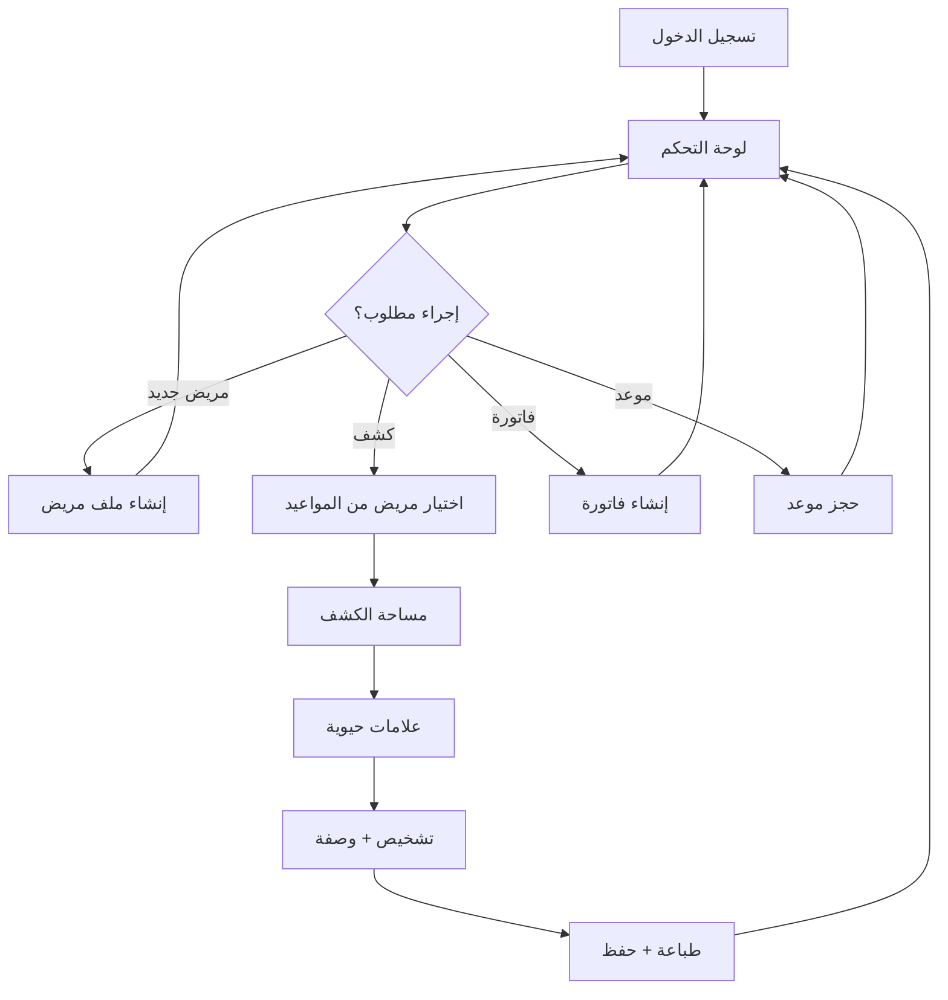

# وثيقة متطلبات المنتج (PRD) – Synapse Systems

## 1. نظرة عامة على المنتج

**Synapse Systems** – نظام إدارة عيادات أطفال متكامل بتصميم عالمي، يعمل بشكل كامل دون اتصال بالإنترنت (Offline-First)، ويقدّم تجربة طبية رقمية فاخرة تجمع بين الأداء الفائق والذكاء التفاعلي والجمال البصري على مستوى Apple + Linear + Notion.

- **المشكلة التي يحلّها**: أنظمة إدارة العيادات الحالية في المنطقة إما قديمة التصميم وبطيئة، أو سحابية لا تعمل بدون إنترنت، أو معقدة في الاستخدام. النظام يقدم بديلاً فاخراً يعمل في كل الظروف.
- **المستخدمون المستهدفون**: أطباء الأطفال، الممرضون/الممرضات، موظفو الاستقبال، الإداريون، مالكو العيادات.
- **القيمة المضافة**: تجربة استخدام ممتعة بصرياً + سرعة فائقة + يعمل بدون إنترنت + قابلية تخصيص كاملة + ذكاء يتعلم من الطبيب.

---

## 2. الميزات الجوهرية

### 2.1 أدوار المستخدمين

| الدور | طريقة الدخول | الصلاحيات الجوهرية |
|------|-------------|-------------------|
| مدير النظام (Admin) | اسم مستخدم + كلمة مرور | إدارة المستخدمين + الإعدادات + رؤية كل البيانات |
| طبيب (Doctor) | اسم مستخدم + كلمة مرور + PIN | إدارة المرضى + الكشوفات + الوصفات + طباعة التقارير |
| ممرض/ة (Nurse) | اسم مستخدم + كلمة مرور | إدارة المواعيد + قياس العلامات الحيوية + تحديث بيانات المرضى |
| موظف استقبال (Receptionist) | اسم مستخدم + كلمة مرور | إدارة المواعيد + الفواتير + الدفع + تسجيل المرضى الجدد |

### 2.2 وحدات النظام

1. **شاشة الدخول (Login)**: تسجيل دخول أنيق + اختيار اللغة + استعادة كلمة المرور
2. **لوحة التحكم (Dashboard)**: إحصائيات حية + مواعيد اليوم + تنبيهات ذكية + اختصارات سريعة
3. **المرضى (Patients)**: قائمة + بحث فوري + ملف المريض التفصيلي + تاريخ الزيارات
4. **الكشف (Exam Workspace)**: مساحة كشف قابلة للتخصيص + قوالب ذكية + علامات حيوية + تشخيص + وصفات
5. **المواعيد (Appointments)**: تقويم أسبوعي/يومي + إنشاء/تعديل + تذكيرات + حالات (مكتمل/ملغي/في الانتظار)
6. **العلاجات (Treatments & Prescriptions)**: وصف أدوية + جرعات + طباعة + تاريخ
7. **المخبر (Lab)**: طلبات تحاليل + نتائج + طباعة
8. **اللقاحات (Vaccines)**: جدول اللقاحات حسب العمر + تذكيرات + توثيق
9. **الفواتير (Invoices)**: إنشاء فاتورة + تعدد العملات (ل.س/$/€) + خصومات + طباعة
10. **التقارير (Reports)**: إحصائيات المرضى + الإيرادات + المواعيد + تقارير مخصصة
11. **الإعدادات (Settings)**: معلومات العيادة + الشعار + العملات + النسخ الاحتياطي + المستخدمون
12. **سجل التدقيق (Audit Log)**: كل العمليات الحساسة مسجلة

### 2.3 تفاصيل الصفحات

| اسم الصفحة | اسم الوحدة | وصف الميزة |
|-----------|-----------|-----------|
| شاشة الدخول | Hero + Login Card | خلفية سداسية متحركة + بطاقة دخول زجاجية + اختيار اللغة في الأعلى |
| لوحة التحكم | Stat Cards | 4 بطاقات: مرضى اليوم، مواعيد اليوم، إيرادات اليوم، تنبيهات |
| لوحة التحكم | Upcoming Appointments | قائمة بأقرب 5 مواعيد مع صور المرضى |
| لوحة التحكم | Quick Actions | أزرار: مريض جديد + كشف سريع + موعد جديد + فاتورة سريعة |
| المرضى | Search Bar | بحث فوري عبر الاسم/الهاتف/الرقم + اختصارات لوحة المفاتيح |
| المرضى | Patient List | قائمة افتراضية مع صورة + عمر + آخر زيارة + الإجراءات السريعة |
| المرضى | Patient Detail | 4 تبويبات: المعلومات / الزيارات / اللقاحات / الفواتير |
| الكشف | Vital Signs | بطاقات تفاعلية للحرارة، الوزن، الطول، الضغط، النبض، الأكسجين |
| الكشف | Diagnosis | محرر نصوص مع قوالب جاهزة + اقتراحات ذكية |
| الكشف | Prescription | قائمة أدوية مع بحث + جرعات + تعليمات |
| المواعيد | Calendar View | تقويم بصري بألوان حسب الحالة + ساعات قابلة للسحب |
| المواعيد | Appointment Card | بطاقة زجاجية + صورة المريض + الوقت + الطبيب + الحالة |
| الفواتير | Invoice Form | بنود ديناميكية + حساب تلقائي + خصم + ضرائب |
| الفواتير | Invoice Print | قالب طباعة فاخر مع شعار العيادة + رقم + QR |
| الإعدادات | Clinic Profile | شعار + اسم + عنوان + هاتف + ساعات العمل |
| الإعدادات | Users & Roles | إدارة المستخدمين + الصلاحيات |

---

## 3. العمليات الجوهرية

### 3.1 رحلة المستخدم الرئيسية

**الطبيب** يفتح النظام يومياً → يرى لوحة التحكم بمواعيد اليوم والتنبيهات → يختار مريض من المواعيد → يدخل إلى مساحة الكشف → يقيس العلامات الحيوية (الممرض مسبقاً) → يكتب التشخيص من القوالب أو بحرية → يضيف وصفة طبية → يطبع الوصفة → يحفظ الكشف → يذهب للمريض التالي.

**موظف الاستقبال** يستقبل مريض جديد → يبحث في القائمة أولاً → إن لم يوجد يضيف مريض جديد (الاسم، تاريخ الميلاد، الجنس، الهاتف، العنوان، ملاحظات) → يحجز موعد → يصدر فاتورة عند الدفع.

**الممرض** يفتح المواعيد القادمة → يجهز ملف المريض (العلامات الحيوية قبل الكشف) → يضع علامة "جاهز للكشف".

### 3.2 مخطط التدفق (Mermaid)

---

## 4. تصميم واجهة المستخدم

### 4.1 أسلوب التصميم

**الاتجاه الجمالي**: "Luxury Medical OS" – فخامة طبية عصرية مستوحاة من Linear وApple وArc.

- **الألوان الأساسية**:
  - Primary: Deep Medical Blue `#1E3A8A` → `#3B82F6` (تدرج)
  - Accent: Soft Violet `#8B5CF6`
  - Success: Teal `#14B8A6`
  - Warning: Amber `#F59E0B`
  - Danger: Rose `#F43F5E`
  - Neutral (Light): `#F8FAFC` خلفية، `#0F172A` نص
  - Neutral (Dark): `#0B1120` خلفية، `#E2E8F0` نص

- **الخطوط**:
  - العربية: IBM Plex Sans Arabic (عناوين + نصوص)
  - الإنجليزية: Inter (عناوين) + IBM Plex Sans (نصوص)
  - Fluid Typography عبر `clamp()`

- **الأشكال والحدود**:
  - Border Radius: 12px للبطاقات، 8px للأزرار، 16px للنوافذ
  - Shadows: طبقات متعددة (Soft Elevation)
  - Glassmorphism خفيف على البطاقات المهمة

- **الخلفية المميزة**:
  - شبكة سداسية (Hexagonal Grid) متحركة بثلاث طبقات عمق
  - تتفاعل مع حركة الماوس (parallax + glow)
  - ألوان متدرجة: أزرق عميق → بنفسجي → تركواز
  - في الوضع الداكن: توهج نيوني خفيف

- **الحركة**:
  - Page transitions: Fade + Slide مع Framer Motion
  - Hover: scale(1.02) + shadow أقوى
  - Loading: Skeleton + Shimmer
  - Success: Confetti خفيف + haptic (موبايل)

- **الأيقونات**: Lucide React بأسلوب Stroke ناعم
- **الوضع الداكن**: مدعوم بشكل كامل ومحسّن (ليس مجرد عكس ألوان)

### 4.2 نظرة عامة على تصميم الصفحات

| اسم الصفحة | اسم الوحدة | العناصر البصرية |
|-----------|-----------|-----------------|
| شاشة الدخول | خلفية | شبكة سداسية متحركة بـ 3 طبقات + توهج عند الماوس |
| شاشة الدخول | بطاقة الدخول | Glass card مع blur، حقول أنيقة، زر gradient |
| لوحة التحكم | Stat Cards | 4 بطاقات بأيقونات Lucide + رقم متحرك + تغيير يومي |
| لوحة التحكم | التقويم المصغر | تقويم بصري مع نقاط ملونة للمواعيد |
| المرضى | شريط البحث | بحث فوري مع اختصارات + نتائج منسدلة أنيقة |
| المرضى | بطاقة المريض | صورة رمزية + اسم + عمر + آخر زيارة + actions |
| ملف المريض | Header | صورة + اسم كبير + عمر + ملاحظات + أزرار سريعة |
| ملف المريض | التبويبات | تبويبات زجاجية مع indicator متحرك |
| مساحة الكشف | شبكة العلامات الحيوية | 6 بطاقات قابلة للسحب والإفلات (ترتيب مخصص) |
| مساحة الكشف | محرر التشخيص | Textarea فاخر + chips للقوالب + حفظ تلقائي |
| المواعيد | التقويم | عرض أسبوعي/يومي + أحداث ملونة + drag للسحب |
| الفواتير | قالب الطباعة | ترويسة أنيقة + شعار + جدول + مجموع + توقيع |

### 4.3 الاستجابة

- **Desktop First**: التصميم الأساسي للشاشات الكبيرة (1280px+)
- **Mobile Adaptive**: تخطيط عمود واحد على الموبايل مع تحويل القوائم لدرج (Drawer)
- **Tablet Optimized**: تخطيط متوسط مع جوانب قابلة للطي
- **Touch Optimization**: أهداف لمس لا تقل عن 44px + haptic feedback

### 4.4 إرشادات المشهد ثلاثي الأبعاد (للخلفية السداسية)

- **الأجواء**: غلاف جوي تقني-طبي عميق مع عمق ضبابي
- **الإضاءة**: ضوء ناعم من الزاوية العلوية اليسرى + توهج متحرك عند الماوس
- **الحركة**: بطيئة وعضوية، تتباطأ عند "وضع التركيز" (فتح كشف/فاتورة)
- **التركيب**: شبكة منتظمة + 3 طبقات تتحرك بسرعات مختلفة (Parallax)
- **التفاعل**: كل سداسي يستجيب للماوس بإضاءة خفيفة + موجة عند النقر
- **الأداء**: Canvas + requestAnimationFrame، إيقاف كامل عند `prefers-reduced-motion`
- **الحدود**: 60fps على أجهزة متوسطة، 30fps كحد أدنى على الموبايل

---

## 5. معايير القبول

| المعيار | الهدف |
|---------|------|
| أداء | Time to Interactive < 2s على أجهزة متوسطة |
| إمكانية الوصول | WCAG 2.2 AA كحد أدنى |
| الأمان | تشفير محلي (محاكاة) + سجل تدقيق |
| Offline | 100% من الوظائف الأساسية تعمل محلياً (localStorage/IndexedDB) |
| التوافق | Windows 10/11 + Android 10+ + iOS 15+ (تصميم) |
| التوطين | عربي (RTL) + إنجليزي بمستوى أصلي |
| قابلية الصيانة | TypeScript strict + مكونات < 300 سطر |
| التجربة | مستوى Linear/Arc في السلاسة البصرية |

---

## 6. نطاق النسخة الأولى (MVP Web Demo)

نظراً للحجم الكامل للرؤية، النسخة الأولى عبارة عن **تطبيق ويب تفاعلي شامل** يُظهر:

- ✅ شاشة دخول مع خلفية سداسية حية
- ✅ لوحة تحكم كاملة
- ✅ إدارة المرضى (CRUD + بحث فوري)
- ✅ ملف المريض التفصيلي
- ✅ مساحة الكشف مع علامات حيوية وقوالب
- ✅ المواعيد (تقويم + إدارة)
- ✅ الفواتير (إنشاء + طباعة)
- ✅ الإعدادات
- ✅ RTL/LTR + عربي/إنجليزي
- ✅ Light/Dark mode
- ✅ بيانات تجريبية واقعية

**التقنيات**: React 19 + TypeScript + Vite + Tailwind + Framer Motion + Zustand + React Router + Lucide React.
**التخزين**: localStorage (محاكاة لقاعدة بيانات) + Zustand persist.
**الطباعة**: نافذة طباعة مخصصة بـ CSS print.
