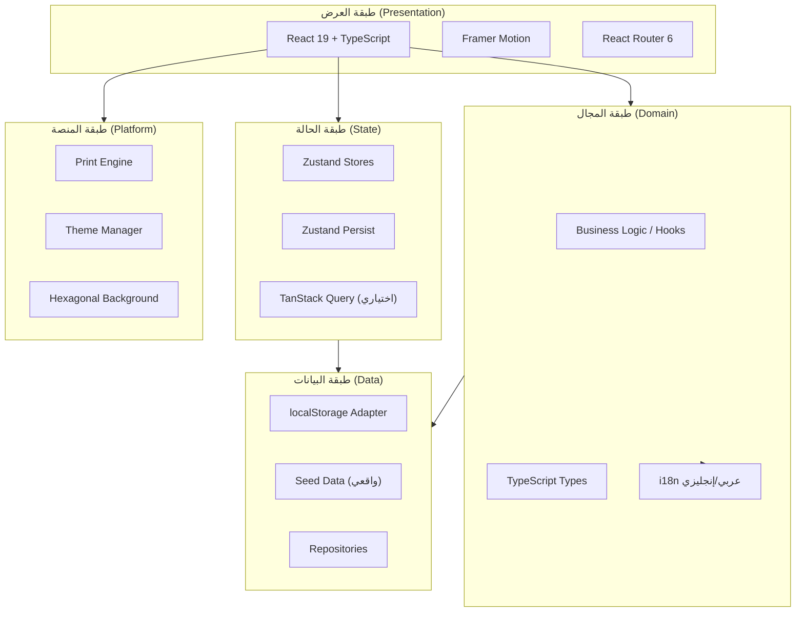
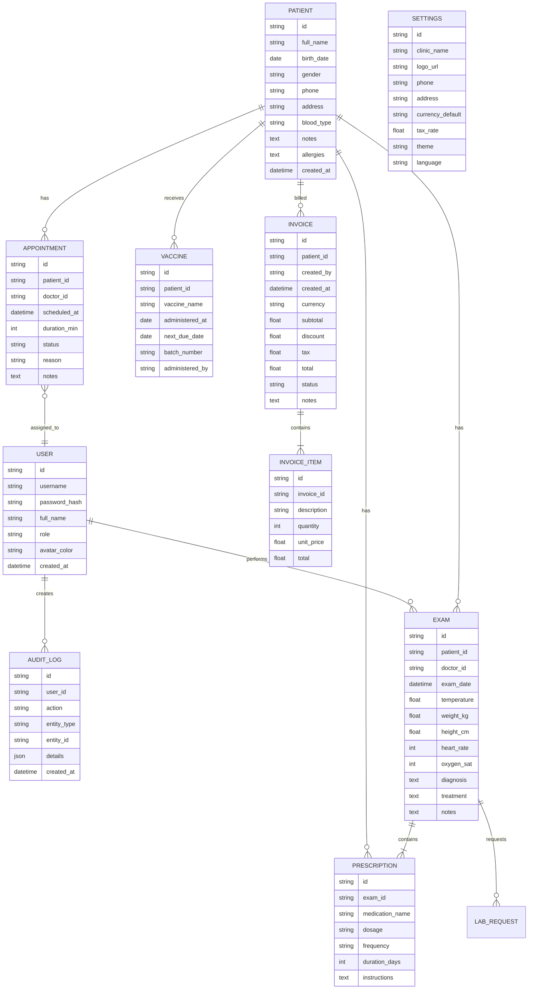

# المعمارية التقنية – Synapse Systems

## 1. تصميم المعمارية



### مبادئ معمارية

1. **طبقات مفصولة بوضوح**: كل طبقة لها مسؤولية واحدة.
2. **حالة قابلة للتوقع**: Zustand stores صغيرة ومحددة.
3. **استقلالية البيانات**: طبقة Repository تسمح بتبديل المخزن لاحقاً.
4. **المكونات نقية قدر الإمكان**: تفاعلها عبر Props وStores.
5. **الأداء أولاً**: Virtualized lists، memoization، lazy effects.

---

## 2. وصف التقنيات

### 2.1 الواجهة الأمامية
- **React 19** + **TypeScript** (strict mode)
- **Vite 5** كمنشئ سريع التحديث
- **Tailwind CSS 3** للتنسيق السريع + Custom CSS للخلفيات المتقدمة
- **Framer Motion** للحركة والتفاعلات
- **Zustand 5** لإدارة الحالة (مع `persist` للتخزين المحلي)
- **React Router 6** للتنقل
- **Lucide React** للأيقونات
- **date-fns** للتعامل مع التواريخ
- **clsx + tailwind-merge** لتنظيف classes

### 2.2 البيانات
- **localStorage** كقاعدة بيانات في المتصفح (MVP)
- **Zustand Persist middleware** للتخزين التلقائي
- **Seed data واقعي** (10+ مرضى، 15+ موعد، فواتير، إلخ)

### 2.3 الخلفية
- **لا توجد خلفية منفصلة** في النسخة الأولى (Frontend-only)
- طبقة Repository معدة لاستبدال المخزن بـ API حقيقي لاحقاً

### 2.4 البناء والنشر
- **Vite Build** للإخراج الإنتاجي
- **Static Hosting** (Vercel/Netlify جاهز)
- **PWA-ready** (Manifest + Service Worker skeleton)

---

## 3. تعريف المسارات (Routes)

| المسار | الصفحة | الوصف | يتطلب صلاحية |
|--------|--------|------|---------------|
| `/login` | Login | شاشة الدخول | لا |
| `/` | Dashboard | لوحة التحكم | نعم |
| `/patients` | PatientsList | قائمة المرضى + بحث | نعم |
| `/patients/:id` | PatientDetail | ملف المريض | نعم |
| `/patients/new` | PatientNew | مريض جديد | نعم |
| `/exams/:patientId` | ExamWorkspace | مساحة الكشف | Doctor |
| `/exams/:patientId/:examId` | ExamDetail | تعديل كشف | Doctor |
| `/appointments` | Appointments | التقويم والمواعيد | نعم |
| `/invoices` | Invoices | الفواتير | Receptionist+ |
| `/invoices/new` | InvoiceNew | فاتورة جديدة | Receptionist+ |
| `/invoices/:id` | InvoiceDetail | تفاصيل + طباعة | نعم |
| `/reports` | Reports | التقارير | Admin+ |
| `/settings` | Settings | الإعدادات | Admin |
| `/audit` | AuditLog | سجل التدقيق | Admin |

---

## 4. نماذج البيانات (Data Models)

### 4.1 مخطط ER



### 4.2 مخزن الحالة (Zustand Stores)

```typescript
// AuthStore
{
  currentUser: User | null,
  isAuthenticated: boolean,
  login: (username, password) => boolean,
  logout: () => void,
}

// PatientsStore
{
  patients: Patient[],
  addPatient: (data) => Patient,
  updatePatient: (id, data) => void,
  deletePatient: (id) => void,
  getPatient: (id) => Patient | undefined,
  search: (query) => Patient[],
}

// AppointmentsStore
{
  appointments: Appointment[],
  addAppointment: (data) => Appointment,
  updateAppointment: (id, data) => void,
  deleteAppointment: (id) => void,
  getByDate: (date) => Appointment[],
  getByPatient: (patientId) => Appointment[],
}

// ExamsStore
{
  exams: Exam[],
  prescriptions: Prescription[],
  addExam: (data) => Exam,
  updateExam: (id, data) => void,
  getByPatient: (patientId) => Exam[],
  templates: ExamTemplate[],
}

// InvoicesStore
{
  invoices: Invoice[],
  items: InvoiceItem[],
  addInvoice: (data) => Invoice,
  updateInvoice: (id, data) => void,
  getByPatient: (patientId) => Invoice[],
}

// SettingsStore
{
  clinic: ClinicInfo,
  theme: 'light' | 'dark' | 'system',
  language: 'ar' | 'en',
  updateClinic: (data) => void,
  setTheme: (theme) => void,
  setLanguage: (lang) => void,
}

// UIStore (transient state)
{
  sidebarOpen: boolean,
  commandPaletteOpen: boolean,
  focusMode: boolean,
  toggleSidebar: () => void,
  openCommandPalette: () => void,
}
```

---

## 5. بنية المجلدات

```
src/
├── main.tsx                      # نقطة الدخول
├── App.tsx                       # الجذر + Router
├── index.css                     # أنماط عامة + متغيرات الثيم
│
├── components/                   # مكونات قابلة لإعادة الاستخدام
│   ├── ui/                       # مكونات أساسية (Button, Input, Card, ...)
│   ├── layout/                   # Shell, Sidebar, Topbar
│   ├── hexagonal/                # الخلفية السداسية التفاعلية
│   ├── patients/                 # مكونات المرضى
│   ├── exams/                    # مكونات الكشف
│   ├── appointments/             # مكونات المواعيد
│   ├── invoices/                 # مكونات الفواتير
│   └── common/                   # EmptyState, Skeleton, ...
│
├── pages/                        # صفحات التطبيق
│   ├── Login.tsx
│   ├── Dashboard.tsx
│   ├── PatientsList.tsx
│   ├── PatientDetail.tsx
│   ├── PatientNew.tsx
│   ├── ExamWorkspace.tsx
│   ├── Appointments.tsx
│   ├── Invoices.tsx
│   ├── InvoiceNew.tsx
│   ├── InvoiceDetail.tsx
│   ├── Reports.tsx
│   ├── Settings.tsx
│   └── AuditLog.tsx
│
├── stores/                       # Zustand stores
│   ├── authStore.ts
│   ├── patientsStore.ts
│   ├── appointmentsStore.ts
│   ├── examsStore.ts
│   ├── invoicesStore.ts
│   ├── settingsStore.ts
│   └── uiStore.ts
│
├── hooks/                        # Custom React Hooks
│   ├── useTheme.ts
│   ├── useTranslation.ts
│   ├── useDebounce.ts
│   ├── useKeyboardShortcuts.ts
│   └── useFocusMode.ts
│
├── lib/                          # مكتبات مساعدة
│   ├── i18n.ts                   # قاموس الترجمة
│   ├── format.ts                 # تنسيق العملة، التاريخ، الأرقام
│   ├── audit.ts                  # تسجيل التدقيق
│   ├── storage.ts                # طبقة التخزين
│   └── utils.ts
│
├── types/                        # TypeScript Types
│   ├── patient.ts
│   ├── appointment.ts
│   ├── exam.ts
│   ├── invoice.ts
│   ├── user.ts
│   └── index.ts
│
├── data/                         # بيانات تجريبية
│   └── seed.ts
│
└── styles/                       # أنماط إضافية
    ├── print.css                 # أنماط الطباعة
    └── animations.css            # حركات مخصصة
```

---

## 6. معمارية الخلفية السداسية (Hexagonal Background)

```
<HexagonalBackground>
  ├── Canvas (full viewport, behind everything)
  ├── Layer 1: Slow far hexagons (depth 0.3)
  ├── Layer 2: Medium hexagons (depth 0.6)
  ├── Layer 3: Close hexagons (depth 1.0) - interactive
  ├── Mouse tracking via mousemove event
  ├── Glow radius around cursor
  ├── Click → wave animation
  ├── requestAnimationFrame loop
  └── Respects prefers-reduced-motion
```

**خوارزمية الرسم**:
1. شبكة axial coordinates `(q, r)` تملأ الشاشة + هامش
2. كل سداسي يُرسم بـ `ctx.lineTo` على 6 رؤوس
3. اللون من تدرج بناءً على المسافة من الماوس
4. opacity يتغير مع المسافة والطبقة

---

## 7. الأمان (ضمن النسخة)

- كلمات المرور تُخزن "مشفرة" بـ base64 في MVP (للتجريب فقط)
- Session timeout بعد 30 دقيقة من عدم النشاط
- تسجيل كل العمليات الحساسة في AuditLog
- التحقق من الصلاحيات في كل عملية

**تنبيه**: هذه المحاكاة للعرض. في الإنتاج الفعلي، يجب استخدام Backend حقيقي مع bcrypt + JWT.

---

## 8. الأداء

- **Code splitting**: لا حاجة في MVP، حزم واحدة
- **Memoization**: `React.memo` على مكونات البطاقات الثقيلة
- **Debounce**: على حقل البحث (200ms)
- **Canvas optimization**: Hexagons ثابتة في الـ size، فقط opacity تتغير
- **CSS variables**: للثيم لتبديل فوري
- **Zustand selectors**: تجنب re-renders غير ضرورية

---

## 9. إمكانية الوصول

- Semantic HTML (header, nav, main, section)
- ARIA labels على الأيقونات التفاعلية
- Focus visible ring واضح
- Keyboard navigation كاملة (Tab, Enter, Esc, Ctrl+K)
- ألوان بمقابلة WCAG AA على الأقل
- Skip to main content link

---

## 10. النشر

- **Build**: `npm run build` → مجلد `dist/`
- **Preview**: `npm run preview` للمعاينة المحلية
- **Deploy**: Vercel/Netlify (static) أو استضافة عادية
- **PWA**: إضافة `manifest.json` و Service Worker skeleton

---

## 11. خارطة الطريق للمراحل اللاحقة

1. **Backend API**: Node.js + Express + SQLite
2. **Auth حقيقي**: JWT + bcrypt
3. **Electron wrapper**: لتطبيق سطح المكتب
4. **Capacitor**: لتطبيقات الموبايل
5. **Sync engine**: WebSocket + Conflict resolution
6. **E2E encryption**: SQLCipher
7. **Advanced Reports**: مخططات بيانية + تصدير PDF
8. **AI features**: اقتراحات التشخيص + تلخيص الزيارات
